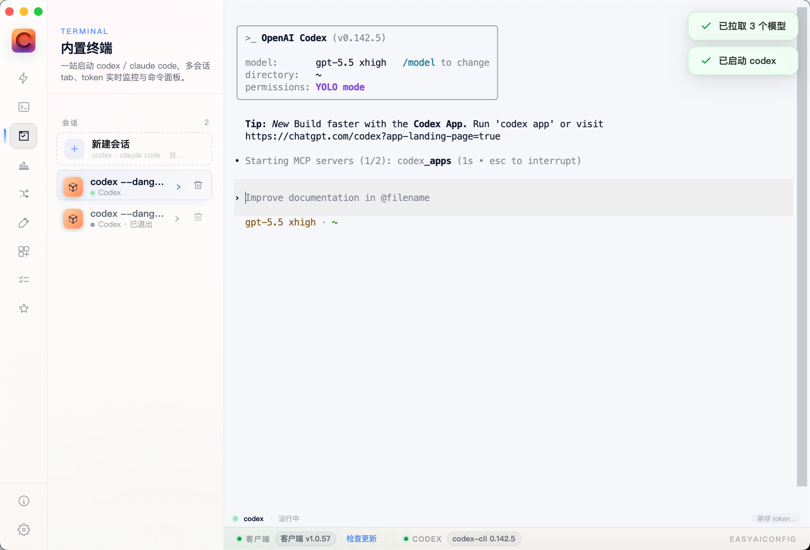

<p align="center">
  
</p>

<h1 align="center">EasyAIConfig</h1>

<p align="center">
  <strong>Codex / Claude Code / OpenCode / OpenClaw 一站式配置助手 — 让 AI 编程工具的配置简单到一键搞定</strong>
</p>

<p align="center">
  <strong>Windows 处于实验性支持；推荐优先使用桌面安装包，Web/CLI 模式在 Windows 会保留控制台窗口。</strong>
</p>

<p align="center">
  <a href="https://github.com/lmk1010/EasyAIConfig/releases/latest"></a>
  <a href="https://github.com/lmk1010/EasyAIConfig/blob/main/LICENSE"></a>
  <a href="https://github.com/lmk1010/EasyAIConfig/actions"></a>
</p>

---

## [UI] 截图预览

> 以下截图中的账号、Base URL 与本地路径已做匿名处理。

### 一键配置与 Provider 管理


### 数据看板


### 自动路由网关


### 配置编辑


### 工具安装与管理


### 内置终端



---

## [Core] 已支持功能（当前版本）

### [What's New] v1.0.55

- 安全：npm 发包瘦身 — 加 `files` 字段，tarball 从 11.3MB / 140 文件 → 1.3MB / 34 文件
- 安全：Tauri CSP 收紧 — `'self' + tauri: + 仅 GitHub/api.github.com 出站`，关闭 XSS / 远程脚本面
- 安全：去除源码注释里的私人 provider 名残留
- 清理：`.idea/` `.neox/` 不再入 git；测试脚本 .txt 全部清空
- 补全：加 MIT LICENSE 与 package.json author / repository / homepage / bugs

### [What's New] v1.0.53

- 新增：**支持的模型** 卡片化管理 — Provider 详情页一行一个模型，点击即可设为默认，悬停删除
- 新增：**Live 模型自动入库** — `从 Provider 拉取 (/v1/models)` 检测到的模型自动加入「支持的模型」
- 新增：**模型预设大扩展** — Kimi K2.7 Code / GLM 5.x / DeepSeek V4 / Qwen3 全系列 / 豆包 1.5 / 混元 / MiniMax / Llama 4 等近百个最新模型，涵盖国内外主流厂商
- 新增：内置终端（Codex / Claude / OpenCode 会话浏览 + 实时输出）
- 新增：会话恢复（Codex 最近会话浏览 / 一键恢复 / 导出）
- 新增：独立 Codex App 的一键安装与打开入口
- 优化：编辑抽屉表单 — 全部控件统一 32px 高度、像素级垂直居中、文字不再被裁切
- 优化：「支持的模型」抽屉多选 — 单行摘要显示，无嵌套卡片
- 优化：静态资源 no-cache + 版本化加载，桌面端 reload 永远拿最新版本
- 优化：官方登录 + 中转 API Key 共存场景 Provider 切换更顺滑

### 核心能力

| 状态 | 功能 | 说明 |
|------|------|------|
| 已支持 | **Provider 管理** | 一键配置 Base URL + API Key，自动写入配置文件 |
| 已支持 | **官方登录模式** | 自动识别 Codex / ChatGPT OAuth 登录态，可直接设为默认 OpenAI Provider |
| 已支持 | **模型检测** | 自动发现可用模型（live /v1/models），自动入库到「支持的模型」 |
| 已支持 | **支持的模型管理** | 卡片化展示 / 点击设为默认 / 悬停删除 / 内置近百模型预设可勾选 |
| 已支持 | **多 Provider 切换** | 支持保存多套 Provider 并快速切换 |
| 已支持 | **配置编辑器** | 可视化分类编辑（模型与推理 / 行为与审计 / 上下文 / 路径 / 会话恢复 / Provider 与备份 / 开关 / 指令）+ 原始 TOML / JSON |
| 已支持 | **备份与恢复** | 保存前自动备份，支持一键回滚 |
| 已支持 | **数据看板** | Codex / Claude Code 用量与费用估算，按模型 / 按日 / P95 时延、缓存率分析 |
| 已支持 | **内置终端** | Codex / Claude / OpenCode 会话浏览 + 实时输出 + 多会话切换 |
| 已支持 | **会话恢复** | Codex 最近会话浏览 / 一键 resume / 复制命令 / 导出 |
| 已支持 | **工具安装管理** | Codex CLI / Claude Code / OpenCode / OpenClaw / Codex App / VS Code & Cursor 扩展 一键安装 / 更新 / 卸载 |
| 已支持 | **桌面客户端** | Tauri 桌面端（macOS aarch64 / x64，Windows .msi / .exe，Linux .deb / .AppImage） |
| 已支持 | **自动更新（桌面版）** | Tauri 桌面端支持 GitHub Releases 自动检查与安装更新 |

### 工具支持矩阵

| 工具 | 安装 / 更新 / 卸载 | 启动 | 登录 / 初始化 | 配置管理 | 运行状态 |
|------|----------------|------|-------------|----------|----------|
| **Codex CLI** | 已支持 | 已支持 | 已支持 (`codex login`) | 已支持 (`~/.codex/config.toml` + `.env`) | 已支持 |
| **Claude Code** | 已支持 | 已支持 | 已支持 (OAuth 登录) | 已支持 (`~/.claude/settings.json`) | 已支持 |
| **OpenClaw** | 已支持（一键 / WSL / 脚本） | 已支持（Gateway 启动） | 已支持 (`onboard`) | 已支持 (`~/.openclaw/openclaw.json`) | 已支持 |
| **OpenCode** | 已支持（官方脚本 / Homebrew / npm / Scoop / Chocolatey） | 已支持 | 规划中 | 规划中 | 规划中 |

### 内置模型预设（覆盖主流厂商）

| 厂商 | 代表模型 |
|------|---------|
| **OpenAI** | GPT-5.5 / 5.4 / 5.3 Codex / 5.2 / 5.1 Codex Max / o4-mini / o3 Pro |
| **Anthropic** | Claude Fable 5 / Opus 4.8 / Sonnet 4.6 / Haiku 4.5 |
| **Google** | Gemini 3 Pro / 3 Pro Thinking / 2.5 Pro / Flash |
| **xAI** | Grok 4.1 / 4 Fast / Code Fast 1 |
| **DeepSeek** | V4 / V4 Coder / V4 Thinking / V3.3 / R2 / R1 / Coder V3 |
| **Qwen (阿里)** | Qwen3 Max / Coder Plus / 235B-A22B / QwQ 32B / Qwen-VL Max |
| **Kimi / Moonshot** | K2.7 Code / K2.5 / K2 / K2 Thinking / Moonshot V1 128K |
| **GLM / 智谱** | GLM 5.2 / 5.1 / 5 / 4.6 / Z1 Air / Z1 32B / 4V Plus / CodeGeeX 4 |
| **豆包 / 字节** | 1.5 Pro 256K / Lite / Thinking Pro / Vision Pro |
| **腾讯混元** | Turbo S / Pro / Large 389B / T1 |
| **MiniMax / 阶跃 / 其他** | MiniMax M2 / Step 2 / Baichuan / Yi Lightning / 星火 4.0 / 文心 4.5 |
| **开源 / 海外** | Llama 4 Maverick / Scout / Behemoth / Mistral Large 2.5 / Codestral 2 / Command R+ / Perplexity Sonar |

> 找不到你的模型？直接在「支持的模型 → 添加模型」里输入自定义 slug，或点「从 Provider 拉取」让工具自动入库 live 检测到的模型。

## [Todo] 未来功能待办（Roadmap）

| 优先级 | 待办项 | 状态 |
|--------|--------|------|
| P1 | 启动失败一键诊断（自动收集环境与命令日志） | 规划中 |
| P1 | 配置导入 / 导出（跨机器迁移） | 规划中 |
| P1 | Provider 可用性定时巡检与告警提示 | 规划中 |
| P2 | Dashboard 自定义统计维度与时间范围 | 规划中 |
| P2 | 多语言界面（中文 / English） | 规划中 |
| P3 | 配方（Recipes）模板扩展与社区分享 | 规划中 |

## [Install] 安装

### [Desktop] 桌面版（推荐）

最新版本下载统一在 Releases：
[https://github.com/lmk1010/EasyAIConfig/releases/latest](https://github.com/lmk1010/EasyAIConfig/releases/latest)

> Windows 桌面版处于实验性支持。若不想看到 `cmd` 黑窗口，请使用桌面安装包；`npm start` / `easyaiconfig` Web 模式在 Windows 属于控制台程序，会保留终端窗口。

| 平台 | 推荐安装包 | 下载链接 |
|------|------------|----------|
| macOS (Apple Silicon) | `.dmg`（`aarch64`） | [下载 macOS 版本](https://github.com/lmk1010/EasyAIConfig/releases/latest) |
| macOS (Intel) | `.dmg`（`x64`） | [下载 macOS 版本](https://github.com/lmk1010/EasyAIConfig/releases/latest) |
| Windows | `.msi` / `.exe` | [下载 Windows 版本](https://github.com/lmk1010/EasyAIConfig/releases/latest) |
| Linux | `.AppImage` / `.deb` | [下载 Linux 版本](https://github.com/lmk1010/EasyAIConfig/releases/latest) |

下载后请按文件名中的架构选择：
- `aarch64` / `arm64`：Apple Silicon
- `x64` / `x86_64`：Intel / AMD 64 位

### [Web] Web 模式

```bash
npm install -g easyaiconfig
easyaiconfig
```

启动本地服务后自动打开浏览器。

## [QuickStart] 快速开始

1. **选择认证方式** — 可直接用 `官方登录`（OAuth）或切换 `API Key` 模式
2. **官方登录路径** — 点击「设为默认 OpenAI Provider」后直接保存并启动
3. **API Key 路径** — 输入 Base URL + API Key，自动识别 Provider 和环境变量
4. **检测模型** — 一键发现可用模型并推荐默认项；live 检测到的模型自动入库到「支持的模型」
5. **保存并启动** — 写入 `~/.codex/config.toml` + `.env`，并直接启动 Codex

## [Dev] 开发

### [Prerequisites] 前置要求

- **Node.js** ≥ 18
- **Rust** ≥ 1.77（桌面开发）
- **npm** ≥ 8

### [Web Dev] Web 开发模式

```bash
npm install
npm start
```

### [Desktop Dev] 桌面开发模式

```bash
npm install
npm run desktop:dev
```

### [Build] 桌面打包

```bash
npm run desktop:build
```

## [Tree] 项目结构

```
├── public/            # 前端静态文件（HTML / CSS / JS）
│   ├── index.html     # 主页面
│   ├── styles.css     # 样式
│   └── app.js         # 前端逻辑 + 模型预设 catalog
├── src/
│   ├── server.js      # Express 后端（Web 模式 + Tauri 共用）
│   └── lib/
│       ├── config-store.js   # 配置读写核心
│       └── provider-check.js # Provider 连通性检测
├── src-tauri/         # Tauri 桌面端
│   ├── src/
│   │   ├── lib.rs     # Tauri 入口
│   │   ├── config.rs  # 配置管理
│   │   ├── provider.rs # Provider 逻辑
│   │   └── routes.rs  # API 路由
│   └── icons/         # 应用图标
├── assets/            # README 截图与 logo
└── .github/workflows/ # CI/CD
```

## [Release] 发布配置

### [Signing] 生成签名密钥

```bash
npx tauri signer generate -w ~/.tauri/easyaiconfig.key
```

### [Secrets] GitHub Secrets

在仓库 Settings → Secrets 中配置：

| Secret | 说明 |
|--------|------|
| `TAURI_SIGNING_PRIVATE_KEY` | 签名私钥（完整文件内容） |
| `TAURI_SIGNING_PRIVATE_KEY_PASSWORD` | 私钥密码 |

> **提示**：推荐使用 GitHub CLI 写入密钥以避免换行损坏：
> ```bash
> gh secret set TAURI_SIGNING_PRIVATE_KEY < ~/.tauri/easyaiconfig.key
> gh secret set TAURI_SIGNING_PRIVATE_KEY_PASSWORD
> ```

### [Tag] 发布新版本

推送 tag 即可触发自动构建与发布：

```bash
git tag v1.0.55
git push origin v1.0.55
```

## [Contributing] 贡献

欢迎 PR / Issue。重点欢迎的方向：
- 新模型 slug 入库（在 `public/app.js` 的 `CODEX_MODEL_PRESETS` 里加）
- 新工具集成（Codex / Claude / OpenCode / OpenClaw 之外的）
- 国际化（English UI）
- Windows 兼容性验收与签名

## License

[MIT](LICENSE)
